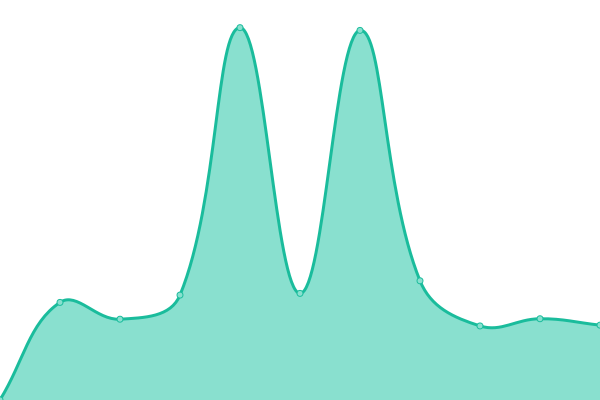

# [📈 Live Status](https://status.emnichtda.de): <!--live status--> **🟧 Partial outage**

This repository contains the open-source uptime monitor and status page for [EmnichtdaYT | Zoe](https://www.emnichtda.de/), powered by [Upptime](https://github.com/upptime/upptime).

With [Upptime](https://upptime.js.org), you can get your own unlimited and free uptime monitor and status page, powered entirely by a GitHub repository. We use [Issues](https://github.com/EmnichtdaYT/emnichtda-services/issues) as incident reports, [Actions](https://github.com/EmnichtdaYT/emnichtda-services/actions) as uptime monitors, and [Pages](https://status.emnichtda.de) for the status page.

<!--start: status pages-->
<!-- This summary is generated by Upptime (https://github.com/upptime/upptime) -->
<!-- Do not edit this manually, your changes will be overwritten -->
<!-- prettier-ignore -->
| URL | Status | History | Response Time | Uptime |
| --- | ------ | ------- | ------------- | ------ |
|  [www.emnichtda.de](https://www.emnichtda.de) | 🟥 Down | [www-emnichtda-de.yml](https://github.com/EmnichtdaYT/emnichtda-services/commits/HEAD/history/www-emnichtda-de.yml) | 

 2411ms
     
 | 

<a href="https://status.emnichtda.de/history/www-emnichtda-de">94.06%</a>
    

|  [matrix.emnichtda.de](https://matrix.emnichtda.de/_synapse/client) | 🟩 Up | [matrix-emnichtda-de.yml](https://github.com/EmnichtdaYT/emnichtda-services/commits/HEAD/history/matrix-emnichtda-de.yml) | 

 448ms
     
 | 

<a href="https://status.emnichtda.de/history/matrix-emnichtda-de">100.00%</a>
    

|  [ptero.emnichtda.de](https://ptero.emnichtda.de/api/client) | 🟨 Degraded | [ptero-emnichtda-de.yml](https://github.com/EmnichtdaYT/emnichtda-services/commits/HEAD/history/ptero-emnichtda-de.yml) | 

 1337ms
     
 | 

<a href="https://status.emnichtda.de/history/ptero-emnichtda-de">94.27%</a>
    

<!--end: status pages-->

[**Visit our status website →**](https://status.emnichtda.de)

## 📄 License

- Powered by: [Upptime](https://github.com/upptime/upptime)
- Code: [MIT](./LICENSE) © [EmnichtdaYT | Zoe](https://www.emnichtda.de/)
- Data in the `./history` directory: [Open Database License](https://opendatacommons.org/licenses/odbl/1-0/)
